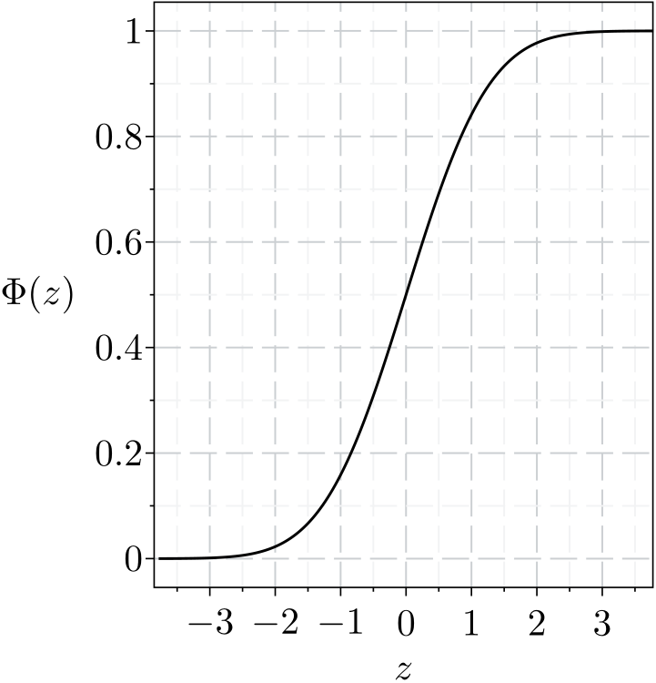

# Ti*k*Z-Styling-Maple

Styling Maple graphics with Ti*k*Z and LaTeX.

---

<figure style="width:361px;">
  
  <figcaption>Figure 1. The standard normal cumulative distribution function Φ(<i>z</i>). The graph body was generated with Maple. The axes, bounding box, tickmarks and text were generated with Ti<i>k</i>Z and LaTeX. Adapted from Stenborg (2025), below.</figcaption>
</figure>

---

### Key Files

- graph_Maple_Distribution.mw &nbsp;&nbsp; Maple graph generation worksheet. 
- graph_Maple_example_bare_input.pdf &nbsp;&nbsp; An example bare Maple graph to style. 
- graph_Maple_example_annotator.ltx &nbsp;&nbsp; LaTeX document that styles graphs via Ti*k*Z. 

The Maple worksheet graphs the standard normal cumulative distribution function. In addition to default Maple output, a bare version with the graph body but no text or axes is output. The bare version can have text and axes reconstructed with Ti*k*Z styling if passed to the LaTeX document.

N.B. A plain text version of the Maple source code appears in graph_Maple_Distribution_source.txt, for inspection outside Maple.

### Software Requirements

- Maple (for graph generation). 
- Perl (optional, called from Maple for PDF cropping). 
- TeX distribution (for Ti*k*Z, LaTeX and, optionally, pdfcrop). 

### Reference

Stenborg, T 2025, "Styling Maple graphics with Ti*k*Z and LaTeX", TUGboat, vol. 46, no. 3, pp. 379&ndash;380.
