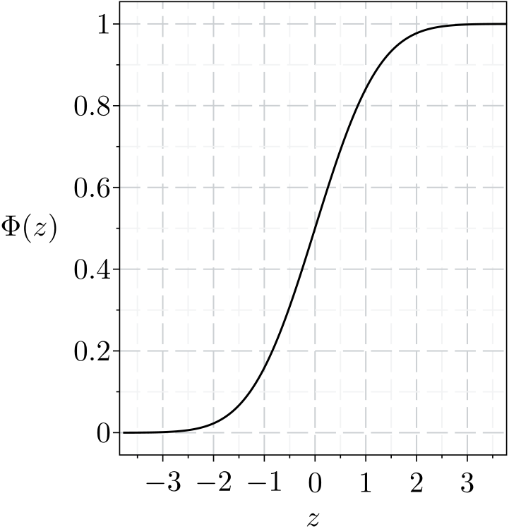

# Ti*k*Z-Styling-Maple

Styling Maple graphics with Ti*k*Z and LaTeX.

---

<figure style="width:361px;">
  
  <figcaption>Figure 1. The standard normal cumulative distribution function Φ(<i>z</i>). The graph body was generated with Maple. The axes, bounding box, tickmarks and text were generated with Ti<i>k</i>Z and LaTeX. Adapted from Stenborg [1].</figcaption>
</figure>

---

## Table of Contents

* [Key Files](#key-files)
* [Software Requirements](#software-requirements)
* [Testing](#testing)
* [Reference](#reference)

### Key Files

| File | Notes |
| :--- | :--- |
| graph_Maple_Distribution.mw | Maple graph generation worksheet. |
| graph_Maple_example_bare_input.pdf | An example bare Maple graph to style. |
| graph_Maple_example_annotator.ltx | LaTeX document that styles graphs via Ti*k*Z. |

The Maple worksheet graphs the standard normal cumulative distribution function. In addition to default Maple output, a bare version with the graph body but no text or axes is output. The bare version can have text and axes reconstructed with Ti*k*Z styling if passed to the LaTeX document.

N.B. A plain text version of the Maple source code appears in graph_Maple_Distribution_source.txt, for inspection outside Maple.

### Software Requirements

- Maple (for graph generation). 
- Perl (optional, called from Maple for PDF cropping). 
- TeX distribution (for Ti*k*Z, LaTeX and, optionally, pdfcrop). 

### Testing

The software has been tested with the following system configuration.

| Operating System | Maple Version |
| :--- | :--- |
| Windows 11 Home (version 24H2) | 2025.1 |

### Reference

1. Stenborg, T 2025, "[Styling Maple graphics with Ti*k*Z and LaTeX](https://tug.org/TUGboat/tb46-3/tb144stenborg-maple.pdf)", TUGboat, vol. 46, no. 3, pp. 379&ndash;380.
